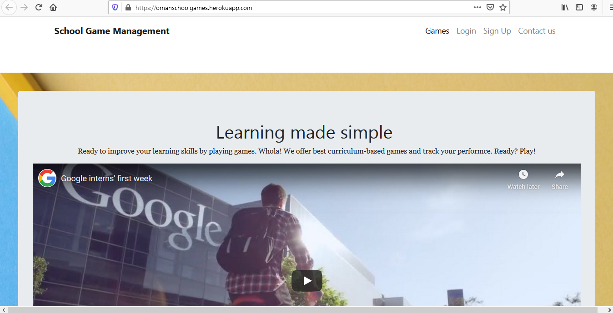
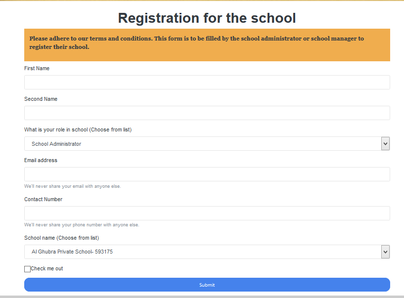
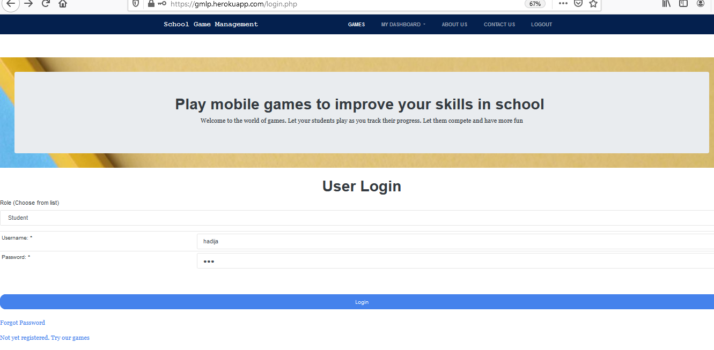
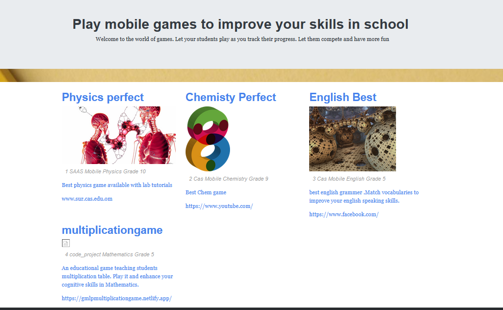
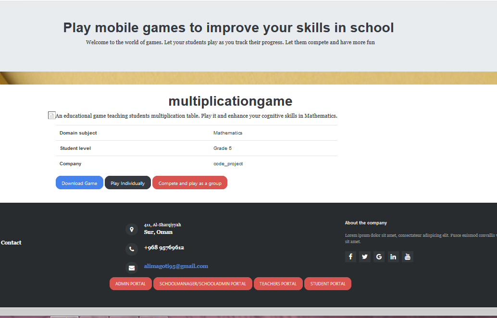
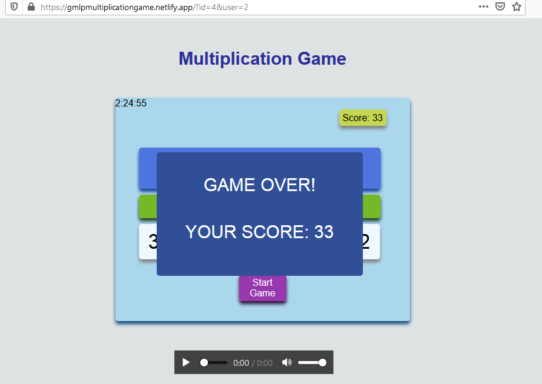
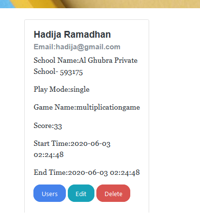

MOBILE_GAME_MANAGEMENT_PLATFORM
# Mobile Game platform for school kids
An app that registers schools and give them access to **mobile and web application games**. The games follow the school curriculum and range from all subjects like mathematics, English etc. Scores are sent to the web app for management. 
This app uses 
- PHP REST API
- Javascript fetch API
- front end html,css, bootstrap
- msql database

## Front Page of the App

## Registration for the school

## login as a student
usename as **hadija** and password as **123**

## choose the game you need to play
Your email and username will be used in the game. If you choose play individually, you are redirected directly to the game.
If you coose play as a group, you will be given options of others student to send them a ticket invitation to join the competiton.

## Now go under dashboard and view your grades 

